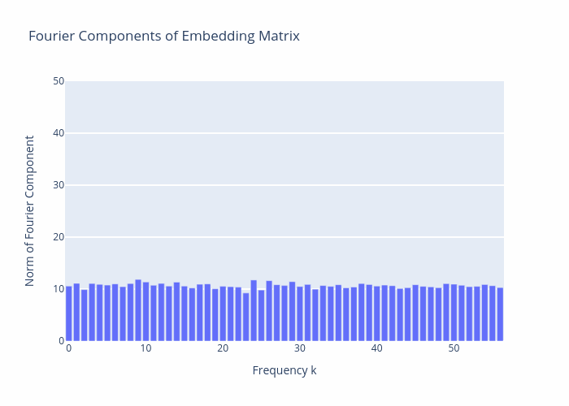

<div align="center">

# Grokking Experiments

<a href="https://pytorch.org/get-started/locally/"></a>
<a href="https://pytorchlightning.ai/"></a>
<a href="https://hydra.cc/"></a>
<a href="https://github.com/ashleve/lightning-hydra-template"></a><br>

</div>

## Description

This repo is for experiments related to grokking, inspired by the 
[Progress Measures for Grokking via Mechanistic Interpretability](https://arxiv.org/pdf/2301.05217.pdf) paper. 

The initial goal is to reproduce the results and analysis from the paper. Then the aim is to run additional experiments in 
the same general set-up to aid my understanding and intuition of the phenomena described in the paper.


Using Softmax1 as proposed [here](https://www.evanmiller.org/attention-is-off-by-one.html) appears to produce cleaner 
fourier components than the original Softmax. Could investigate this further. May just because it leads to faster convergence.




## TODO
- [x] implement dataset and datamodule
- [x] implement model
- [x] confirm that model displays grokking behaviour
- [ ] reproduce the analysis from the paper
  - [x] Fourier components of embedding matrix
  - [x] Fourier components of neuron-logit map
  - [x] Attention score for head 0
  - [x] Activations for neuron 0
  - [x] Norms of logits in 2d fourier basis
  - [ ] test and train loss over time
  - [ ] test and train accuracy over time
  - [ ] FVE by degree-2 polynomials
  - [ ] Components of W_L corresponding to freq 14 neurons
  - [ ] Loss after ablating frequencies
  - [ ] Test, train, excluded loss over all freqs
  - [ ] Restricted test, train, excluded loss
  - [ ] Gini coefficients of embed matrix and neuron-logit map
  - [ ] Total sum of squared weights
- [ ] run additional experiments

## Notes
### Loss Spikes
I observed loss spikes during training to begin with. I initially assumed this must be the same phenomenon as described 
[here](https://www.alignmentforum.org/posts/N6WM6hs7RQMKDhYjB/a-mechanistic-interpretability-analysis-of-grokking) but 
in this case it didn't appear to be solved just by using the `cross_entropy_high_precision` function from the 
[original implementation](https://github.com/mechanistic-interpretability-grokking/progress-measures-paper/tree/main).
I found that the initialisation of the embed, unembed and positional encoding weights was the cause - in the 
original implementation they are initialised with a normal distribution normalised by the sqrt of the output dimension.

## How to run

Install dependencies

```bash
# clone project
git clone https://github.com/RoganInglis/grokking-experiments.git
cd grokking-experiments

# [OPTIONAL] create conda environment
conda create -n myenv python=3.9
conda activate myenv

# install pytorch according to instructions
# https://pytorch.org/get-started/

# install requirements
pip install -r requirements.txt
```

Train model with default configuration

```bash
# train on CPU
python src/train.py trainer=cpu

# train on GPU
python src/train.py trainer=gpu
```

Train model with chosen experiment configuration from [configs/experiment/](configs/experiment/)

```bash
python src/train.py experiment=experiment_name.yaml
```

You can override any parameter from command line like this

```bash
python src/train.py trainer.max_epochs=20 datamodule.batch_size=64
```
